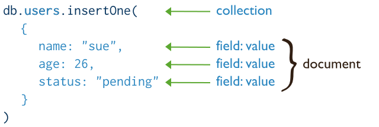
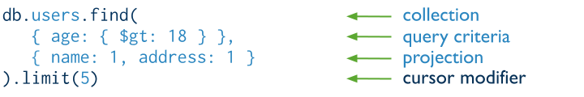

# Formation Mongo DB

## Opérations CRUD

### CREATE : Insertion de documents
Insérer un document


Exemple
```js
use mongo-training
db.trainings.insertOne(
    {
        nom : "Formation Mongo DB",
        description : "Une formation introductive",
        date : "07/11/2017"
    }
)
```
Aquitement
```js
{
        "acknowledged" : true,
        "insertedId" : ObjectId("5a01860ed4dba15e9353bf53")
}
```

`Imaginez d'autres formations et insérer les .... puis utilisez la fonction find pour afficher après chaque insertion.`

Utiliser la fonction insertMany pour réinsérer les documents précédents
```js
db.trainings.insertMany(
    [ <document 1> , <document 2>, ... , <document n>]
)
```


### READ : requêtes sur les documents
Rechercher un ou plusieurs documents


Exemple : Tous les id de documents
```js
db.trainings.find({},{_id: 1})
```

Exemple : Tous les nom des documents
```js
db.trainings.find({},{nom: 1})
```

#### Les filtres


| criterion |Description |
|---------|------------|
| $eq     | Matches values that are equal to a specified value. |
| $gt     | Matches values that are greater than a specified value.|
| $gte    | Matches values that are greater than or equal to a specified value.| 
| $in     | Matches any of the values specified in an array.| 
| $lt     | Matches values that are less than a specified value.| 
| $lte    | Matches values that are less than or equal to a specified value.| 
| $ne     | Matches all values that are not equal to a specified value.| 
| $nin    | Matches none of the values specified in an array.| 

Correspondance SQL
```SQL
SELECT * FROM table
```
Filtre appliqué : fonction find sans paramètres
```js
db.trainings.find()
```

